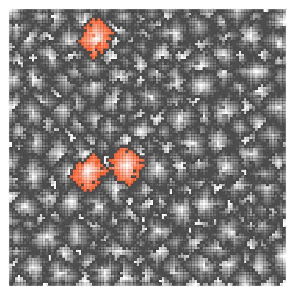

# Links

https://adventofcode.com/
https://carbon.now.sh/ to show off code
https://www.reddit.com/r/adventofcode/

## Solvers and Solutions

- [Reddit Megathreads](https://www.reddit.com/r/adventofcode/wiki/solution_megathreads)
- Day 2 using [{R6} objects](https://github.com/karawoo/adventofcode2021/blob/main/R/day02.R#L98-L150)
- [Hvitfeldt's solutions](https://emilhvitfeldt.github.io/rstats-adventofcode/2021.html)
- Day 9 [also using igraph](https://twitter.com/rappa753/status/1468876602016735233)
- [Antoine Fabri's page](https://github.com/moodymudskipper/adventofcode2021)
- day 10 [using regmatches](https://twitter.com/TeaStats/status/1469239054625648645)
- day 8 [animation](https://www.reddit.com/r/adventofcode/comments/rbuvq3/2021_day_8_part_2pygame_code_breaker/)
- day 14 [animation](https://twitter.com/nbardiuk/status/1470761538969645067)
- [mebeim's page](https://t.co/SyFa8xep8N)


# Day 16: Packet Decoder

We are to decode nested packets of hexadecimal. Each packet begins with three bits that encode the packet version. The next three bits encode the packet ID type. The next set of bits of the packet depends on the packet ID type, and may themselves represent additional packets nested within the packet. If it is the outermost packet, it may also end with trailing zeros, which are to be ignored.

Packets with a type ID of 4 are for holding a literal value, a single binary number. The number is broken up into four-bit big-endian subsets called groups. Each group is preceeded by a 1-bit except the last group, which is preceeded by a 0-bit. The groups together are then padded with leading zeros until they are a multiple of 4 bits.

Type ID:
- 0: sum of values in sub-packets
- 1: product of values in sub-packets
- 2: minimum of values in sub-packets
- 3: maximum of values in sub-packets
- 4: a literal value packet
- 5: greater than packets, returns 1 if value of first sub-packet is greater than value of second sub-packet, otherwise returns 0; must have exactly two sub-packets
- 6: less than packets, returns 1 if value of first sub-packet is less than value of second sub-packet, otherwise returns 0; must have exactly two sub-packets
- 7: equals to packets, returns 1 if value of first sub-packet is equal to than value of second sub-packet, otherwise returns 0; must have exactly two sub-packets

```r

halfbit_to_bin <- function(x) {
  if (x == "0") out <- c(0, 0, 0, 0)
  if (x == "1") out <- c(0, 0, 0, 1)
  if (x == "2") out <- c(0, 0, 1, 0)
  if (x == "3") out <- c(0, 0, 1, 1)
  if (x == "4") out <- c(0, 1, 0, 0)
  if (x == "5") out <- c(0, 1, 0, 1)
  if (x == "6") out <- c(0, 1, 1, 0)
  if (x == "7") out <- c(0, 1, 1, 1)
  if (x == "8") out <- c(1, 0, 0, 0)
  if (x == "9") out <- c(1, 0, 0, 1)
  if (x == "a") out <- c(1, 0, 1, 0)
  if (x == "b") out <- c(1, 0, 1, 1)
  if (x == "c") out <- c(1, 1, 0, 0)
  if (x == "d") out <- c(1, 1, 0, 1)
  if (x == "e") out <- c(1, 1, 1, 0)
  if (x == "f") out <- c(1, 1, 1, 1)
  out <- as.logical(out)
  return(out)
}

hex_to_bin <- function(x) {
  x <- tolower(strsplit(x, "")[[1]])
  out <- logical()
  for (i in 1:length(x)) {
    add <- halfbit_to_bin(x[i])
    out <- c(out, add)
  }
  return(out)
}

bin_to_dec <- function(x) {
  sum((2^((length(x):1) - 1)) * x)
}

parse_bits_packet_jar <- function(x, n = Inf) {
  out <- list()
  packet_counter <- 1
  while (packet_counter <= n & length(x) >= 11 & !all(x == FALSE)) {
    out[[packet_counter]] <- parse_bits_packet(x)
    x <- x[-(1:out[[packet_counter]]$total_length)]
    packet_counter <- packet_counter + 1
  }
  return(out)
}

parse_bits_packet <- function(x){
  if (!all(is.logical(x))) {
    x <- hex_to_bin(x)
  }
  out <- list()
  out$packet_version = bin_to_dec(x[1:3])
  out$packet_type_id = bin_to_dec(x[4:6])
  out$version_sum <- out$packet_version
  if (out$packet_type_id == 4) {
    data <- x[7:length(x)]
    group_ids <- data[seq(0, (length(data) - 1), by = 5) + 1]
    last_group_start <- 5 * (min(which(group_ids == 0)) - 1) + 1
    data <- data[1:(last_group_start + 4)]
    out$n_groups <- length(data) %/% 5
    out$total_length <- 6 + out$n_groups * 5
    group_id <- (1:length(data) - 1) %/% 5 + 1
    ids <- 1:out$n_groups
    value <- logical()
    for (id in ids) {
      group_data <- data[which(group_id == id)]
      value <- c(value, group_data[2:5])
      if (group_data[1] == FALSE) break()
    }
    out$literal_value <- bin_to_dec(value)
    out$expression <- out$literal_value
  } else {
    out$length_type_id <- x[7]
    if (out$length_type_id == 1) {
      out$subpacket_count <- bin_to_dec(x[0:10 + 8])
      subpackets <- x[19:length(x)]
      out$subpackets <- parse_bits_packet_jar(subpackets, out$subpacket_count)
      out$total_length <- 18
      for (i in 1:length(out$subpackets)) {
        out$total_length <- out$total_length + out$subpackets[[i]]$total_length
      }
    } else {
      out$subpacket_length <- bin_to_dec(x[0:14 + 8])
      subpackets <- x[23 + 0:(out$subpacket_length - 1)]
      out$subpackets <- parse_bits_packet_jar(subpackets)
      out$total_length <- 23 + (out$subpacket_length - 1)
    }
    for (i in 1:length(out$subpackets)) {
      out$version_sum <- out$version_sum + out$subpackets[[i]]$version_sum
    }
    # add arguments
    out$arguments <- character(0)
    for (i in 1:length(out$subpackets)) {
      if (i == 1) {
         out$arguments <- out$subpackets[[i]]$expression
      } else {
        out$arguments <- paste(out$arguments, out$subpackets[[i]]$expression, sep = ",")
      }
    }
    out$arguments <- paste0("(", out$arguments, ")")

    # add operator
    # # in R, everything is a function call!
    if (out$packet_type_id == 0) out$operator <- "'sum'"
    if (out$packet_type_id == 1) out$operator <- "'prod'"
    if (out$packet_type_id == 2) out$operator <- "'min'"
    if (out$packet_type_id == 3) out$operator <- "'max'"
    if (out$packet_type_id == 5) out$operator <- "'>'"
    if (out$packet_type_id == 6) out$operator <- "'<'"
    if (out$packet_type_id == 7) out$operator <- "'=='"
    
    # create expression
    out$expression <- paste0(out$operator, out$arguments)

    # evaluate too??
    out$evaluation <- eval(parse(text = out$expression))
  }
  return(out)
}

dat <- parse_bits_packet(readLines("day16_input.txt"))
dat$version_sum == 951 # part one
dat$evaluation == 902198718880 # part two

```


# Day 15: Chiton

Given a two-dimensional array of integers, find the up-down-left-right path that has the lowest total value. You start in the top-left cell, and you don't count that cell's value in your total score, but every other cell along the path is added together to get the total risk score.

```r

calc_least_cost_path <- function(path, use_full = FALSE) {

  raw <- readLines(path)
  diag <- FALSE

  # load first tile
  n <- length(raw)
  m <- nchar(raw[1])
  cost <- matrix(NA, nrow = n, ncol = m)
  for (i in 1:length(raw)) cost[i,] <- as.numeric(strsplit(raw[i], "")[[1]])

  if (use_full) {
    # construct full map, 5x5 = 25 tiles
    # each tile increments all values by +1 down and +1 right
    cost_full <- matrix(NA, nrow = n * 5, ncol = m * 5)
    register_map <- c(1:9, 1:8) # highest value is 9 + 8 -> 8
    for (k in 1:5) {
      for (j in 1:5) {
        cost_to_add <- cost + (j - 1) + (k - 1)
        cost_to_add <- matrix(register_map[cost_to_add], nrow = n, ncol = m)
        cost_full[(j - 1)*n + 1:n, (k - 1)*m + 1:m] <- cost_to_add
      }
    }
    cost <- cost_full
    n <- nrow(cost)
    m <- ncol(cost)
  }

  dist <- matrix(Inf, nrow = n, ncol = m)
  dist[1] <- 0
  i_to_check <- 1:(n * m)
  path <- vector("list", length(dist)) # linear address
  
  # in an R matrix, the linear index i is top-left to bottom-right
  # the j,k address is [(i - 1) %% nrow(m) + 1, (i - 1) %/% nrow(m) + 1]
  # and the i address is j + (k - 1) * nrow(m)

  while (length(i_to_check) > 0) {
    if (length(i_to_check) %% ((n*m)/100) == 0) print(round(length(i_to_check)/(n*m), 2))
    # identify the current minimum-distance entry in dist & discard
    min_i <- i_to_check[which.min(dist[i_to_check])]
    i_to_check <- setdiff(i_to_check, min_i)
    # identify neighbors in the grid in north-south, east-west relationships only
    min_j <- (min_i - 1) %% n + 1
    min_k <- (min_i - 1) %/% n + 1
    neighbors_j <- min_j + c(0, 0, -1, 1)
    neighbors_k <- min_k + c(-1, 1, 0, 0)
    neighbors_i <- neighbors_j + (neighbors_k - 1) * n
    drop <- which(neighbors_j < 1 | neighbors_j > n | neighbors_k < 1 | neighbors_k > m)
    if (length(drop) > 0) neighbors_i <- neighbors_i[-drop]
    neighbors_i <- intersect(neighbors_i, i_to_check)
    for (neighbor in neighbors_i) {
      if (diag) print(paste("evaluating neighbor", neighbor, "of current minimum", min_i))
      if (cost[neighbor] + dist[min_i] < dist[neighbor]) {
        dist[neighbor] <- cost[neighbor] + dist[min_i]
        if (diag) print(paste("dist to patch", neighbor, "now", dist[neighbor], "via patch", min_i))
        path[[neighbor]] <- c(path[[min_i]], min_i)
      } else {
        if (diag) print (paste("path to", neighbor, "unchanged"))
      }
    }
  }

  return(dist[n*m])
}

# part one:
calc_least_cost_path("day15_input_test.txt") == 40 # 0.063 sec
calc_least_cost_path("day15_input.txt") == 583 # 3.002 sec

# part two:
calc_least_cost_path("day15_input_test.txt", use_full = TRUE) == 315 # 0.226 sec
calc_least_cost_path("day15_input.txt", use_full = TRUE) == 2927 # 4554 sec, 1.2 hrs

```


# Day 14: Extended Polymerization

https://adventofcode.com/2021/day/14

Here we want to know how many atoms will be involved in a polymer growth process. Start with a string like `NNCB` which represents four atoms in a chain, and apply insertion rules like `NC -> B`. This means, for a sequence of elements `N` and `C` we insert a `B` element in-between them. All insertions happen simultaneously, lengthening the polymer chain. The starting input is a chain of 20 atoms. Our target is to count up the most common and least common elements in the resulting polymer after 10 growth steps (in Part One) and afte 40 steps (in Part Two).

Initially I tried just growing the new vector, but things quickly get intractable. The vector doubles every step, so for an initial length of $x$, after $n$ steps the vector is length $2^n (x-1) + 1$. The initial 10 steps is no problem, as the vector is now only 19,457 atoms long. However, after 15 or so steps we are at ~600,000 elements and my machine locks up, no where close to 40 steps, when the full polymer will have around 21 *trillion* elements! Clearly we need another strategy.

The key is the problem only wants *counts* of each element, not the actual polymer sequence itself. We can book-keep those in a matrix, as each pair of atoms produces "two" pairs of atoms recursively. As long as we remember that each atom is being counted twice (except for the outer two atoms in the initial polymer), we just recurse the count vector.

```r

count_elements <- function(elements, pairs, pairs_n, x_init) {
  n <- rep(0, nrow(elements))
  for (i in 1:nrow(pairs)) {
    tar <- which(elements$element == substr(pairs$pair[i], 1, 1))
    n[tar] <- n[tar] + pairs_n[i]
    tar <- which(elements$element == substr(pairs$pair[i], 2, 2))
    n[tar] <- n[tar] + pairs_n[i]
  }
  n[which(elements$element == x_init[1])] <- n[which(elements$element == x_init[1])] + 1
  n[which(elements$element == x_init[length(x_init)])] <- n[which(elements$element == x_init[length(x_init)])] + 1
  n <- round(n / 2, 1)
  return(n)
}

tabulate_elements <- function(path) {
  raw <- readLines(path)
  x <- strsplit(raw[1], "")[[1]]
  raw <- raw[3:length(raw)]
  pairs <- data.frame(
    pair = substr(raw, 1, regexpr("\\s", raw) - 1),
    child = substr(raw, regexpr("->\\s", raw) + 3, nchar(raw))
  )
  A <- matrix(0, nrow = nrow(pairs), ncol = nrow(pairs))
  for (i in 1:nrow(pairs)) {
    child_pair_1 <- paste0(substr(pairs$pair[i], 1, 1), pairs$child[i])
    child_pair_2 <- paste0(pairs$child[i], substr(pairs$pair[i], 2, 2))
    # for each pair as a column, flag rows which are children pairs
    A[which(pairs$pair %in% c(child_pair_1, child_pair_2)), i] <- 1
  }
  # tabulate pairs in initial chain x
  pairs$n_initial <- 0
  for (i in 1:(length(x) - 1)) {
    tar <- which(pairs$pair == paste(x[i:(i + 1)], collapse = ""))
    pairs$n_initial[tar] <- pairs$n_initial[tar] + 1
  }
  # A is singular, so gotta matrix-multiply in a for-loop
  n_running <- pairs$n_initial
  for (i in 1:40) {
    n_running <- A %*% n_running
    if (i == 1) pairs$n_after_1 <- n_running
    if (i == 10) pairs$n_after_10 <- n_running
    if (i == 40) pairs$n_after_40 <- n_running
  }
  # now just count how many elements we have
  elements <- data.frame(
    element = sort(unique(pairs$child))
  )
  elements$n_initial <- 0
  for (i in 1:length(x)) {
    elements$n_initial[which(elements$element == x[i])] <- elements$n_initial[which(elements$element == x[i])] + 1
  }
  elements$n_after_1 <- count_elements(elements, pairs, pairs$n_after_1, x)
  elements$n_after_10 <- count_elements(elements, pairs, pairs$n_after_10, x)
  elements$n_after_40 <- count_elements(elements, pairs, pairs$n_after_40, x)
  return(elements)
}

tab <- tabulate_elements("day14_input_test.txt")
max(tab$n_after_10) - min(tab$n_after_10) == 1588
max(tab$n_after_40) == 2192039569602
min(tab$n_after_40) == 3849876073
max(tab$n_after_40) - min(tab$n_after_40) == 2188189693529

tab <- tabulate_elements("day14_input.txt")
max(tab$n_after_10) - min(tab$n_after_10) == 2549 # part 1 answer
max(tab$n_after_40) - min(tab$n_after_40) == 2516901104210 # part 2 answer

```


# Day 13: Transparent Origami

https://adventofcode.com/2021/day/13

Here, we have to "fold" a set of coordinates along specific axes, hopefully decoding a message.

```r

fold_points <- function(path, n_folds = NULL) {
  raw <- readLines(path)
  folds <- raw[grep("^fold along", raw)]
  raw_coords <- raw[grep("^\\d", raw)]
  coords <- matrix(NA, ncol = 2, nrow = length(raw_coords))
  for (i in 1:length(raw_coords)) coords[i, ] <- as.numeric(strsplit(raw_coords[i], ",")[[1]])
  coords[,2] <- coords[,2] * (-1)
  if (!is.null(n_folds)) folds <- folds[1:n_folds]
  for (i in 1:length(folds)) {
    fold <- as.numeric(substr(folds[i], regexpr("=", folds[i]) + 1, nchar(folds[i])))
    if (grepl("y=", folds[i])) {
      fold <- fold * (-1)
      tar <- which(coords[,2] < fold)
      coords[tar,2] <- (2 * fold) - coords[tar,2]
    } else if (grepl("x=", folds[i])) {
      tar <- which(coords[,1] > fold)
      coords[tar,1] <- (2 * fold) - coords[tar,1]
    }
  }
  coords <- coords[-which(duplicated(coords)),]
  return(coords)
}

nrow(fold_points("day13_input_test.txt", n_folds = 1)) == 17
nrow(fold_points("day13_input.txt", n_folds = 1)) == 689

x <- fold_points("day13_input.txt", n_folds = 2)
plot(x)

```


# Day 12: Passage Pathing

https://adventofcode.com/2021/day/12

Part One:

> Your goal is to find the number of distinct paths that start at start, end at end, and don't visit small caves more than once. There are two types of caves: big caves (written in uppercase, like A) and small caves (written in lowercase, like b). It would be a waste of time to visit any small cave more than once, but big caves are large enough that it might be worth visiting them multiple times. So, all paths you find should visit small caves at most once, and can visit big caves any number of times.

Part Two:

> After reviewing the available paths, you realize you might have time to visit a single small cave twice. Specifically, big caves can be visited any number of times, a single small cave can be visited at most twice, and the remaining small caves can be visited at most once. However, the caves named start and end can only be visited exactly once each: once you leave the start cave, you may not return to it, and once you reach the end cave, the path must end immediately.

```r

map_paths <- function(path, once = TRUE) {
  raw <- readLines(path)
  edges <- data.frame(
    node1 = substr(raw, 1, regexpr("-", raw)-1),
    node2 = substr(raw, regexpr("-", raw)+1, nchar(raw))
  )
  rooms <- sort(unique(c(edges[,1], edges[,2])))
  small_rooms <- rooms[!rooms %in% c("start", "end") & substr(rooms, 1, 1) %in% letters]

  paths <- list()
  backtracked_from <- vector("list", length = 50)
  path <- c("start")
  depth <- 1
  valid_paths <- c(edges[which(edges$node1 == "start"),]$node2, edges[which(edges$node2 == "start"),]$node1)
  while (path[depth] != "start" | length(valid_paths) > 0) {
    if (path[depth] != "end" & length(valid_paths) > 0) {
      # keep going
      path <- c(path, valid_paths[1])
      depth <- depth + 1
      small_already_visited <- path[which(path %in% small_rooms)]
      valid_paths <- unique(c(
        edges[which(edges$node1 == path[depth]),]$node2,
        edges[which(edges$node2 == path[depth]),]$node1
      ))
      # never return to the start
      valid_paths <- setdiff(valid_paths, "start")
      if (once | any(duplicated(small_already_visited))) {
        # filter rule: don't return to small rooms already visited
        valid_paths <- setdiff(valid_paths, small_already_visited)
      }
    } else {
      if (path[depth] == "end") paths <- c(paths, list(path))
      # backtrack and choose a different room
      backtracked_from[[depth]] <- character()
      backtracked_from[[depth - 1]] <- c(backtracked_from[[depth - 1]], path[depth])
      path <- path[-depth]
      depth <- depth - 1
      small_already_visited <- path[which(path %in% small_rooms)]
      valid_paths <- unique(c(
        edges[which(edges$node1 == path[depth]),]$node2,
        edges[which(edges$node2 == path[depth]),]$node1
      ))
      # never return to the start
      valid_paths <- setdiff(valid_paths, "start")
      if (once | any(duplicated(small_already_visited))) {
        # filter rule: don't return to small rooms already visited
        valid_paths <- setdiff(valid_paths, small_already_visited)
      }
      # since we are backtracking, also don't revisit the room you just came from
      valid_paths <- setdiff(valid_paths, backtracked_from[[depth]])
    }
  }
  return(paths)
}

```


# Day 11: Dumbo Squid

https://adventofcode.com/2021/day/11

There are 100 octopuses arranged neatly in a 10 by 10 grid. Each octopus slowly gains energy over time and flashes brightly for a moment when its energy is full. 

Each time step, the energy levels increase by 1. If an octopus with a level greater than 9 flashes, increasing the energy levels of all adjacent octopuses by 1, including diagonally adjacent. If this causes any neighbors to exceed an energy level of 9, they also flash. All octopuses who flashed then go to an energy of 0.

In Part One, we want to know how many flashes will occur after a certain number of steps. In Part Two, we want to know the first step when all octopuses will flash simultaneously.

```r

sim_dumbos <- function(path, n_steps) {
  raw <- readLines(path)
  x <- matrix(NA, ncol = nchar(raw[1]), nrow = length(raw))
  for (i in 1:nrow(x)) x[i,] <- as.numeric(strsplit(raw[i], split = "")[[1]])
  n_flashes <- rep(0, n_steps)
  for (step in 1:n_steps) {
    # increment energy by 1
    x <- x + 1
    while (any(x >= 10, na.rm = TRUE)) {
      # identify flashers
      fl <- which(x >= 10)
      # record flash & set state to NA
      n_flashes[step] <- n_flashes[step] + length(fl)
      x[fl] <- NA
      # cascade flash to neighbors, including diagonals
      for (i in 1:length(fl)) {
        fl_j <- ((fl[i] - 1) %% nrow(x)) + 1
        fl_k <- ((fl[i] - 1) %/% nrow(x)) + 1
        north_min <- ifelse(fl_j > 1, fl_j - 1, fl_j)
        south_min <- ifelse(fl_j < nrow(x), fl_j + 1, fl_j)
        east_min <- ifelse(fl_k > 1, fl_k - 1, fl_k)
        west_min <- ifelse(fl_k < ncol(x), fl_k + 1, fl_k)
        x[north_min:south_min, east_min:west_min] <- x[north_min:south_min, east_min:west_min] + 1
      }
    }
    # set flashers' energy to 0
    x[which(is.na(x))] <- 0
  }
  return(n_flashes)
}

n_flashes <- sim_dumbos("day11_input_test.txt", 195)
sum(n_flashes[1:100]) == 1656
min(which(n_flashes == 100)) == 195

n_flashes <- sim_dumbos("day11_input.txt", 1000)
sum(n_flashes[1:100]) == 1649
min(which(n_flashes == 100)) == 256

```


# Day 10: Syntax Scoring

https://adventofcode.com/2021/day/10

Lines with correct syntax have nested opening and closing brackets that all match. A "corrupted" line opens on one left bracket (either `(`, `[`, `{`, or `<`) but closes on the wrong right bracket (either `)`, `]`, `}`, `>`). An "incomplete" line is not corrupted, but has un-matched right brackets. In Part One, our task is to find the corrupted lines and score them. In Part Two, we discard the corrupted lines and find the incomplete lines, complete them, score the completions, and return the median score. I'll do everything in one function, `analyze_lines()`.

```r

score_completion_patterns <- function(patterns) {
  dict <- c(")", "]", "}", ">")
  out <- rep(NA, length(patterns))
  for (i in 1:length(patterns)) {
    dat <- strsplit(patterns[i], split = "")[[1]]
    scores <- match(dat, dict)
    total_score <- 0
    for (j in 1:length(scores)) {
      total_score <- 5 * total_score + scores[j]
    }
    out[i] <- total_score
  }
  return(out)
}

analyze_lines <- function(path) {
  raw <- readLines(path)
  dict <- data.frame(
    start = c("(", "[", "{", "<"),
    stop = c(")", "]", "}", ">"),
    corruption_score = c(3, 57, 1197, 25137)
  )
  out <- data.frame(
    pattern = raw,
    incomplete = NA,
    corrupt = NA,
    corruption_score = NA,
    patch = NA,
    patch_score = NA
  )
  for (i in 1:nrow(out)) {
    dat <- strsplit(out$pattern[i], split = "")[[1]]
    current_chunk <- ""
    corrupt <- rep(FALSE, length(dat))
    for (j in 1:length(dat)) {
      if (dat[j] %in% dict$start) {
        current_chunk <- c(current_chunk, dict$stop[match(dat[j], dict$start)])
      }
      if (dat[j] %in% dict$stop) {
        corrupt[j] <- current_chunk[length(current_chunk)] != dat[j]
        if (!corrupt[j]) current_chunk <- current_chunk[-length(current_chunk)]
      }
    }
    if (any(corrupt)) {
      out$corrupt[i] <- TRUE
      first_corrupt <- dat[min(which(corrupt))]
      out$corruption_score[i] <- dict$corruption_score[match(first_corrupt, dict$stop)]
    } else if (length(current_chunk) > 1) {
      out$incomplete[i] <- TRUE
      out$patch[i] <- paste(rev(current_chunk), collapse = "")
      out$patch_score[i] <- score_completion_patterns(out$patch[i])
    } else {
      out$incomplete[i] <- FALSE
    }
  }
  return(out)
}

d_test <- analyze_lines("day10_input_test.txt")
d <- analyze_lines("day10_input.txt")

# part 1
sum(d_test$corruption_score, na.rm = TRUE) == 26397
sum(d$corruption_score, na.rm = TRUE) == 216297

# part 2
median(d_test$patch_score, na.rm = TRUE) == 288957
median(d$patch_score, na.rm = TRUE) == 2165057169

```


# Day 9: Smoke Basins

https://adventofcode.com/2021/day/9

Given a 2-dimensional matrix of digits, in Part One we are asked to find the local minimums, considering up-down and left-right differences only. In Part Two, we have to measure the size of the *basins* around each minimum, including all values except the 9s which represent the borders between basins, and multiply the sizes of the three largest basins. Initially I did an adjacency matrix approach using the {igraph} package, which works, but the simpler solution is just a `while` loop.

```r

is_matrix_min <- function(x) {
  # calculate discrete gradients to find the minimum
  grad_right <- cbind((x[,2:ncol(x)] - x[,1:(ncol(x) - 1)]), rep(99, nrow(x)))
  grad_left <- cbind(rep(99, nrow(x)), (x[,1:(ncol(x) - 1)] - x[,2:ncol(x)]))
  is_local_min_x  <- grad_right > 0 & grad_left > 0
  grad_down <- rbind((x[2:nrow(x),] - x[1:(nrow(x) - 1),]), rep(99, ncol(x)))
  grad_up <- rbind(rep(99, ncol(x)), (x[1:(nrow(x) - 1),] - x[2:nrow(x),]))
  is_local_min_y  <- grad_down > 0 & grad_up > 0
  is_local_min <- is_local_min_x & is_local_min_y
  return(is_local_min)
}

copy_neighbor <- function(them, me) {
  if (is.na(me)) {
    if (!is.na(them) & them > 0) {
      out <- them
    } else {
      out <- me
    }
  } else {
    out <- me
  }
  return(out)
}

map_basins <- function(x) {
  # much simpler method using a while loop
  bsn <- matrix(NA, nrow = nrow(x), ncol = ncol(x))
  bsn[which(is_matrix_min(x))] <- 1:sum(is_matrix_min(x))
  bsn[which(x == 9)] <- 0 # all borders are group 0 (for now)
  while (any(is.na(bsn))) {
    for (k in 1:ncol(bsn)) {
      for (j in 1:nrow(bsn)) {
        if (is.na(bsn[j, k])) {
          if (j > 1)         bsn[j, k] <- copy_neighbor(bsn[j - 1, k], bsn[j, k])
          if (j < nrow(bsn)) bsn[j, k] <- copy_neighbor(bsn[j + 1, k], bsn[j, k])
          if (k > 1)         bsn[j, k] <- copy_neighbor(bsn[j, k - 1], bsn[j, k])
          if (k < ncol(bsn)) bsn[j, k] <- copy_neighbor(bsn[j, k + 1], bsn[j, k])
        }
      }
    }
  }
  bsn[bsn == 0] <- NA # set all borders to NA
  return(bsn)
}

calc_risk_level <- function(path) {
  raw <- readLines(path)
  x <- matrix(NA, ncol = nchar(raw[1]), nrow = length(raw))
  for (i in 1:nrow(x)) x[i,] <- as.numeric(strsplit(raw[i], split = "")[[1]])
  risk_levels <- x[which(is_matrix_min(x))] + 1
  sum(risk_levels)
}

calc_basin_score <- function(path) {
  raw <- readLines(path)
  x <- matrix(NA, ncol = nchar(raw[1]), nrow = length(raw))
  for (i in 1:nrow(x)) x[i,] <- as.numeric(strsplit(raw[i], split = "")[[1]])
  basin_matrix <- map_basins(x)
  out <- prod(rev(sort(table(basin_matrix)))[1:3])
  return(out)
}

# for part one
calc_risk_level("day9_input_test.txt") == 15
calc_risk_level("day9_input.txt") == 514

# for part two
calc_basin_score("day9_input_test.txt") == 1134
calc_basin_score("day9_input.txt") == 1103130

```




# Day 8: Seven Segment Search

https://adventofcode.com/2021/day/8

The seven segments of a seven-segment display are labelled `a` thru `g`, and can display any digit from 0 to 9:

```
   0:      1:      2:      3:      4:
 aaaa    ....    aaaa    aaaa    ....
b    c  .    c  .    c  .    c  b    c
b    c  .    c  .    c  .    c  b    c
 ....    ....    dddd    dddd    dddd
e    f  .    f  e    .  .    f  .    f
e    f  .    f  e    .  .    f  .    f
 gggg    ....    gggg    gggg    ....

  5:      6:      7:      8:      9:
 aaaa    aaaa    aaaa    aaaa    aaaa
b    .  b    .  .    c  b    c  b    c
b    .  b    .  .    c  b    c  b    c
 dddd    dddd    ....    dddd    dddd
.    f  e    f  .    f  e    f  .    f
.    f  e    f  .    f  e    f  .    f
 gggg    gggg    ....    gggg    gggg

```


We are given ciphers in the following format:

```
be cfbegad cbdgef fgaecd cgeb fdcge agebfd fecdb fabcd edb |
fdgacbe cefdb cefbgd gcbe
```

Before the `|` separator, we have ten patterns which represent the ten digits, but the meaning of each letter has been scrambled with respect to the correct segment for that digit. After the `|` separator is a set of four digits encoded by this cipher, which we want to de-cipher. There are ten such ciphers in the training set, and two hundred ciphers in the validation set.


# Day 7: The Treachery of Whales

https://adventofcode.com/2021/day/7

In Part One, we want to find the (integer) value which minimizes the total absolute deviation of a list of integers representing fuel costs. In Part Two, we want to find the value to minimize the total *cumulative* absolute deviation (e.g. for a list entry 10 and a candidate value 5, there is an absolute deviation of 5 and a cumulative deviation of 1 + 2 + 3 + 4 + 5 = 15).

The value that minimizes total absolute deviation is just the [median](https://en.wikipedia.org/wiki/Median). The cumulative deviation of $n$ is given by $n(n + 1)/2$ and so is directly proportional to the squared deviation $n^2$, which is minimized by the [arithmetic mean](https://en.wikipedia.org/wiki/Arithmetic_mean). Because this isn't quite perfect, and because we must produce integers, the output has to check the local area around the true mean.

```r

total_cost <- function(path, value = NULL) {
  x <- as.numeric(strsplit(readLines(path), ",")[[1]])
  if (is.null(value)) value <- median(x)
  abs_dev <- abs(x - value)
  total_absolute_dev <- sum(abs_dev)
  print(paste("position", value, "has total fuel cost", total_absolute_dev))
  return(total_absolute_dev)
}

total_cost_cumulative <- function(path, value = NULL) {
  if (length(value) < 2) {
    x <- as.numeric(strsplit(readLines(path), ",")[[1]])
    if (is.null(value)) value <- round(mean(x))
    abs_dev <- abs(x - value)
    total_cumulative_abs_dev <- sum(abs_dev * (abs_dev + 1) / 2)
    print(paste("position", value, "has total cumulative fuel cost", total_cumulative_abs_dev))
    return(total_cumulative_abs_dev)
  } else {
    sapply(value, function(z) total_cost_cumulative(path, z))
  }
}

total_cost("day7_input_test.txt", 1) == 41
total_cost("day7_input_test.txt", 3) == 39
total_cost("day7_input_test.txt", 10) == 71
total_cost("day7_input_test.txt") == 37
total_cost("day7_input.txt") == 340987

total_cost_cumulative("day7_input_test.txt") == 168
# "position 5 has total cumulative fuel cost 168"
plot(1:16, total_cost_cumulative("day7_input_test.txt", 1:16))
points(5, 168, pch = 20)

total_cost_cumulative("day7_input.txt") == 96987919
# "position 479 has total cumulative fuel cost 96987919"
total_cost_cumulative("day7_input.txt", 478)
# "position 478 has total cumulative fuel cost 96987874"
total_cost_cumulative("day7_input.txt", 477)
# "position 477 has total cumulative fuel cost 96988829"

x <- 450:500
plot(x, total_cost_cumulative("day7_input.txt", x))
points(479, 96987919, pch = 20)

# local grid search finds the answer

```


# Day 6: Lanternfish population growth

https://adventofcode.com/2021/day/6

Here we model a population of exponentially-growing, immortal lanternfish. Each mature fish can be categorized in one of seven states, representing the number of days remaining until reproduction, from 6 to 0. At the end of day 0, the fish reproduces, and begins the next day in state 6 again along with its offspring. Offspring fish take two days to mature and begin the reproductive cycle in state 6, so we could call those immature states 8 and 7. Given an initial population of fish with known states, we want to project the population size forward using these unconstrained growth rules.

```r

# first approach, 'agent based', representing the state of each individual fish in a vector
sim_lanternfish_abm <- function(path, n_days = 80) {
  init <- as.numeric(strsplit(readLines(path), split = ",")[[1]])
  n_alive <- length(init)
  n_doublings <- n_days %/% 7 + 1
  pop <- rep(8, length.out = n_alive * 2^(n_doublings))
  # initialize living pop
  pop[1:n_alive] <- init
  print(paste("before day 1 there are", n_alive, "lanternfish"))
  # experience each day
  for (i in 1:n_days) {
    pop[1:n_alive] <- pop[1:n_alive] - 1
    n_alive <- n_alive + sum(pop[1:n_alive] == (-1))
    pop[pop == (-1)] <- 6
    if (i %% 10 == 0) print(paste("after day", i, "there are", n_alive, "lanternfish"))
    if (length(pop) < n_alive) stop("vector is too short!")
  }
  print(paste("after day", i, "there are", n_alive, "lanternfish"))
  return(n_alive)
}

# second approach, using a vector of nine state bins
sim_lanternfish_v2 <- function(path, n_days = 80) {
  # initialize counter vector
  n <- rep(0, 9) # number in state 0 is n[0 + 1], in state 8 is n[8 + 1]
  # load initial population
  init <- as.numeric(strsplit(readLines(path), split = ",")[[1]])
  for (i in (0:8 + 1)) {
    n[i] <- sum(init == (i - 1))
  }
  print(paste("before day 1 there are", sum(n), "lanternfish"))
  # experience each day
  for (i in 1:n_days) {
    n[7 + 1] <- n[7 + 1] + n[0 + 1] # parents switch from state 0 to state 7
    n <- c(n[1:8 + 1], n[0 + 1]) # all decrease 1 state; n[0 + 1] new offspring appear in state 8
    if (i %% 10 == 0) print(paste("after day", i, "there are", sum(n), "lanternfish"))
  }
  print(paste("after day", i, "there are", sum(n), "lanternfish"))
  return(sum(n))
}

options(scipen = 999)

sim_lanternfish_abm("day6_input_test.txt", n_days = 18) == 26
sim_lanternfish_v2("day6_input_test.txt", n_days = 18) == 26

sim_lanternfish_abm("day6_input_test.txt") == 5934
sim_lanternfish_v2("day6_input_test.txt") == 5934

# in part 1, we run for 80 days
sim_lanternfish_abm("day6_input.txt") == 385391
sim_lanternfish_v2("day6_input.txt") == 385391

# in part 2, we run for 256 days
# sim_lanternfish_abm("day6_input.txt", 256) won't even run, too big
# sim_lanternfish_abm("day6_input_test.txt", 256) won't even run, too big
sim_lanternfish_v2("day6_input_test.txt", n_days = 256) == 26984457539
sim_lanternfish_v2("day6_input.txt", n_days = 256) == 1728611055389

```

Now let's try with Leslie matricies:

```r

# matrix multiplication approach
sim_lanternfish_v3 <- function(path, n_days = 80) {
  # initialize counter vector
  n <- rep(0, 9) # number in state 0 is n[0 + 1], in state 8 is n[8 + 1]
  # initialize Leslie matrix
  A <- matrix(
    c(
      0,0,0,0,0,0,0,0,1,
      1,0,0,0,0,0,0,0,0,
      0,1,0,0,0,0,0,0,1,
      0,0,1,0,0,0,0,0,0,
      0,0,0,1,0,0,0,0,0,
      0,0,0,0,1,0,0,0,0,
      0,0,0,0,0,1,0,0,0,
      0,0,0,0,0,0,1,0,0,
      0,0,0,0,0,0,0,1,0
    ), byrow = TRUE, ncol = 9
  )
  # load initial population
  init <- as.numeric(strsplit(readLines(path), split = ",")[[1]])
  for (i in (0:8 + 1)) n[i] <- sum(init == 9 - i)
  print(paste("before day 1 there are", sum(n), "lanternfish"))
  # experience each day
  for (i in 1:n_days) {
    n <- A %*% n
    if (i %% 10 == 0) print(paste("after day", i, "there are", sum(n), "lanternfish"))
  }
  print(paste("after day", i, "there are", sum(n), "lanternfish"))
  return(sum(n))
}

matrix.power <- function(A, n) {   # only works for diagonalizable matrices
   e <- eigen(A)
   M <- e$vectors   # matrix for changing basis
   d <- e$values    # eigen values
   return(M %*% diag(d^n) %*% solve(M))
}

# eigen-decomposition approach
sim_lanternfish_v4 <- function(path, n_days = 80) {
  # initialize counter vector
  n <- rep(0, 9) # number in state 0 is n[0 + 1], in state 8 is n[8 + 1]
  # initialize Leslie matrix
  A <- matrix(c(0,0,0,0,0,0,0,0,1,1,0,0,0,0,0,0,0,0,0,1,0,0,0,0,0,0,1,0,0,1,0,0,0,0,0,0,0,0,0,1,0,0,0,0,0,0,0,0,0,1,0,0,0,0,0,0,0,0,0,1,0,0,0,0,0,0,0,0,0,1,0,0,0,0,0,0,0,0,0,1,0), byrow = TRUE, ncol = 9)
  # load initial population
  init <- as.numeric(strsplit(readLines(path), split = ",")[[1]])
  for (i in (0:8 + 1)) n[i] <- sum(init == 9 - i)
  print(paste("before day 1 there are", sum(n), "lanternfish"))
  # use decomposition
  n <- round(as.numeric(matrix.power(A, n_days) %*% n))
  if (i %% 10 == 0) print(paste("after day", i, "there are", sum(n), "lanternfish"))
  print(paste("after day", i, "there are", sum(n), "lanternfish"))
  return(sum(n))
}

sim_lanternfish_v3("day6_input_test.txt", n_days = 18) == 26
sim_lanternfish_v3("day6_input_test.txt") == 5934
sim_lanternfish_v3("day6_input.txt") == 385391
sim_lanternfish_v3("day6_input_test.txt", n_days = 256) == 26984457539
sim_lanternfish_v3("day6_input.txt", n_days = 256) == 1728611055389

sim_lanternfish_v4("day6_input_test.txt", n_days = 18) == 26
sim_lanternfish_v4("day6_input_test.txt") == 5934
sim_lanternfish_v4("day6_input.txt") == 385391
sim_lanternfish_v4("day6_input_test.txt", n_days = 256) == 26984457539
sim_lanternfish_v4("day6_input.txt", n_days = 256) == 1728611055389

```

time out the essential code

```r

tic()
n <- rep(0, 9)
init <- as.numeric(strsplit(readLines("day6_input.txt"), split = ",")[[1]])
for (i in 1:9) n[i] <- sum(init == (i - 1))
for (i in 1:18) {
  n[8] <- n[8] + n[1] # parents switch from state 0 to state 7
  n <- c(n[2:9], n[1]) # all decrease 1 state; offspring to state 8
}
sum(n) # 0.043 seconds
toc()

```


# Day 5: Hydrothermal Venture

We have the start- and stop-coordinates for lines of hydrothermal vents in discrete x-y space, in the format of

```
0,9 -> 5,9
8,0 -> 0,8
9,4 -> 3,4
2,2 -> 2,1
7,0 -> 7,4
6,4 -> 2,0
0,9 -> 2,9
3,4 -> 1,4
0,0 -> 8,8
5,5 -> 8,2
```

Our task is to count up the number of cells in which 2 or more such lines intersect as a sum. In Part One, we consider only horizonal and vertical lines. In Part Two, we consider diagonal lines as well.

```r

map_danger <- function(start, stop, include_diag = FALSE) {
  x_max <- max(c(start[,1], stop[,1]))
  y_max <- max(c(start[,2], stop[,2]))
  vent_map <- matrix(0, ncol = x_max, nrow = y_max)

  for (i in 1:nrow(start)) {
    line_x <- integer()
    line_y <- integer()
    # same x (vertical lines)
    if (start[i,1] == stop[i,1]) {
      line_y <- start[i,2]:stop[i,2]
      line_x <- rep(start[i,1], length(line_y))
    }
    # same y (horizontal lines)
    if (start[i,2] == stop[i,2]) {
      line_x <- start[i,1]:stop[i,1]
      line_y <- rep(start[i,2], length(line_x))
    }
    # diagonal lines
    if (include_diag) {
      if (abs(stop[i,2] - start[i,2]) == abs(stop[i,1] - start[i,1])) {
        line_x <- start[i,1]:stop[i,1]
        line_y <- start[i,2]:stop[i,2]
      }
    }
    if (length(line_y) != length(line_x)) stop("line_x and line_y must have same length!")
    if (length(line_x) > 0 & length(line_y) == length(line_x)) {
      for (j in 1:length(line_y)) {
        vent_map[line_y[j], line_x[j]] <- vent_map[line_y[j], line_x[j]] + 1
      }
    }
  }
  image(vent_map >= 2)
  return(sum(vent_map >= 2))
}

read_coords <- function(path) {
  raw <- readLines(path)
  start <- matrix(NA, nrow = length(raw), ncol = 2)
  stop <- matrix(NA, nrow = length(raw), ncol = 2)

  for (i in 1:length(raw)) {
    coord_strings <- strsplit(raw[i], split = " -> ")[[1]]
    start[i, ] <- as.numeric(strsplit(coord_strings[1], split = ",")[[1]]) + 1
    stop[i, ] <- as.numeric(strsplit(coord_strings[2], split = ",")[[1]]) + 1
  }
  out <- list(start = start, stop = stop)
  return(out)
}

# for part 1, only include horizonal or vertical lines

dat <- read_coords("day5_input_test.txt")
map_danger(dat$start, dat$stop) == 5

dat <- read_coords("day5_input.txt")
map_danger(dat$start, dat$stop) == 7674

# for part 2, include diagonal lines

dat <- read_coords("day5_input_test.txt")
map_danger(dat$start, dat$stop, include_diag = TRUE) == 12

dat <- read_coords("day5_input.txt")
map_danger(dat$start, dat$stop, include_diag = TRUE) == 20898

```


# Day 4: Bingo with a Giant Squid

For a given set of 5x5 bingo boards, find the board that will have the first "bingo" as you proceed through a given sequence of bingo draws. Also find the board that will have the *last* bingo through these draws, a guaranteed loser.

```r

score_board <- function(board, draws) {
  unmarked_sum <- sum(as.numeric(board[!(board %in% draws)]))
  unmarked_sum * draws[length(draws)]
}

read_bingo <- function(path) {
  raw <- readLines(path)
  out <- list()
  out$draws <- as.numeric(strsplit(raw[1], split = ",")[[1]])
  board_starts <- which(raw == "") + 1
  board_starts <- setdiff(board_starts, length(raw) + 1) # just in case it was picking up last line
  out$board_array <- array(NA, dim = c(5, 5, length(board_starts)))
  for (i in 1:length(board_starts)) {
    for (j in 1:5) {
      raw_line <- raw[board_starts[i] + (j - 1)]
      raw_line <- gsub("^\\s+", "", raw_line)
      out$board_array[j,,i] <- as.numeric(strsplit(raw_line, split = "\\s+")[[1]])
    }
  }
  return(out)
}

find_bingos <- function(bingo_dat) {
  past_winners <- integer()
  for (i in 1:length(bingo_dat$draws)) {
    hit_array <- array(bingo_dat$board_array %in% bingo_dat$draws[1:i], dim = dim(bingo_dat$board_array))
    row_sums <- apply(hit_array, c(1, 3), sum) # hit sum for row i, board j
    col_sums <- apply(hit_array, c(2, 3), sum) # hit sum for column i, board j
    winner <- integer()
    if (any(row_sums == 5)) {
      winner <- c(winner, which(apply(row_sums == 5, 2, sum) > 0))
    }
    if (any(col_sums == 5)) {
      winner <- c(winner, which(apply(col_sums == 5, 2, sum) > 0))
    }
    winner <- sort(unique(winner))
    winner <- setdiff(winner, past_winners)
    past_winners <- c(past_winners, winner)
    if (length(winner) == 1) {
      print(paste("board", winner, "is a winner after draw", i))
    }
    if (length(winner) > 1) {
      winner_string <- paste(winner, collapse = ", ")
      print(paste("boards", winner_string, "are winners after draw", i))
    }
    if (length(winner) == dim(bingo_dat$board_array)[3]) break()
    if (length(past_winners) == 0 & i == length(bingo_dat$draws)) {
      print("no winner found after all draws!")
    }
  }
}

dat <- read_bingo("day4_input_test.txt")
find_bingos(dat) # "board 3 is a winner after draw 12"
score_board(dat$board_array[,,3], dat$draws[1:12]) == 4512

dat <- read_bingo("day4_input.txt")
find_bingos(dat) # "board 17 is a winner after draw 22"
score_board(dat$board_array[,,17], dat$draws[1:22]) == 33462

# part 2 - find the last board that wins

dat <- read_bingo("day4_input_test.txt")
find_bingos(dat) # "board 2 is a winner after draw 15"
score_board(dat$board_array[,,2], dat$draws[1:15]) == 1924

dat <- read_bingo("day4_input.txt")
find_bingos(dat) # "board 92 is a winner after draw 83"
score_board(dat$board_array[,,92], dat$draws[1:83]) == 30070

```


# Day 3: Binary Diagnostics

Here we work with a list of binary numbers, all the same length. In Part One, we calculate two new numbers, `gamma` and `epsilon`. Each bit in `gamma` is the most-common bit in the corresponding position of the list. Each bit in `epsilon` is the least-common bit. For a given list, the product of gamma and epsilon is our target. In Part Two, we must find the unique number in the list (the "oxygen consumption score") that contains the most-common bit in the first position, in the second position, and so forth, and find the unique number in the list (the "CO2 scrubber score") that contains the least-common bit in the first position, in the second position, and so forth. Our target in Part Two is again the product of these two numbers.

```r

bin_to_dec <- function(x) {
  sum(rev(x) * 2^((1:length(x)) - 1))
}

most_common_bit <- function(x) mean(x == 1) >= 0.5
least_common_bit <- function(x) !(mean(x == 1) >= 0.5)

load_binary <- function(path) {
  x <- readLines(path)
  stopifnot(all(nchar(x) == nchar(x)[1]))
  bits <- matrix(NA, nrow = length(x), ncol = nchar(x))
  for (i in 1:length(x)) {
    bits[i,] <- as.numeric(strsplit(x, split = "")[[i]])
  }
  return(bits)
}

calc_gamma_epsilon <- function(path) {
  bits <- load_binary(path)
  gamma <- bin_to_dec(apply(bits, 2, most_common_bit))
  epsilon <- bin_to_dec(apply(bits, 2, least_common_bit))
  out <- gamma * epsilon
  return(out)
}

calc_oxygen_co2 <- function(path) {
  bits <- load_binary(path)
  oxy_candidates <- 1:nrow(bits)
  for (i in 1:ncol(bits)) {
    keep <- which(bits[oxy_candidates, i] == most_common_bit(bits[oxy_candidates, i]))
    oxy_candidates <- oxy_candidates[keep]
    if (length(oxy_candidates) == 1) break()
  }
  co2_candidates <- 1:nrow(bits)
  for (i in 1:ncol(bits)) {
    keep <- which(bits[co2_candidates, i] == least_common_bit(bits[co2_candidates, i]))
    co2_candidates <- co2_candidates[keep]
    if (length(co2_candidates) == 1) break()
  }
  oxy_rating <- bin_to_dec(bits[oxy_candidates, ])
  co2_rating <- bin_to_dec(bits[co2_candidates, ])
  out <- oxy_rating * co2_rating
  return(out)
}

# part 1
calc_gamma_epsilon("day3_input_test.txt") == 198
calc_gamma_epsilon("day3_input.txt") == 3374136

# part 2
calc_oxygen_co2("day3_input_test.txt") == 230
calc_oxygen_co2("day3_input.txt") == 4432698

```


# Day 2: Dive!

We calculate our horizonal and vertical position after applying a list of text commands. In Part One, the command `forward 8` just means add 8 to our horizonal displacement, `up 8` means a decrease in depth by 8, and `down 2` an increase in depth of 2. In Part Two, we modify this interpretation: now `up 8` means decrease a quantity called *aim* by 8, and `down 2` means increase aim by 2. When we apply a `forward` command, we increase our horizonal displacement by the number given, and change our vertical displacement by the horizonal change times the aim.

```r

text_to_vectors <- function(path) {
  x <- readLines(path)
  sub_direction <- gsub("\\s.*$", "", x)
  stopifnot(all(sub_direction %in% c("forward", "down", "up")))
  sub_magnitude <- as.numeric(gsub("^.*\\s", "", x))
  stopifnot(all(!is.na(sub_magnitude)))
  deltas <- matrix(0, ncol = 2, nrow = length(x)) # forward deltas, vertical deltas
  for (i in 1:nrow(deltas)) {
    if (sub_direction[i] == "forward") deltas[i, 1] <- sub_magnitude[i]
    # here 'up' and 'down' refer to vertical deltas
    if (sub_direction[i] == "up") deltas[i, 2] <- (-1) * sub_magnitude[i]
    if (sub_direction[i] == "down") deltas[i, 2] <- sub_magnitude[i]
  }
  positions <- matrix(NA, ncol = 2, nrow = (nrow(deltas) + 1)) # horizonal position, vertical position
  positions[1,] <- c(0, 0)
  # horizonal position as cumulative horizonal deltas
  positions[2:nrow(positions), 1] <- cumsum(deltas[, 1])
  # vertical position as cumulative vertical deltas
  positions[2:nrow(positions), 2] <- cumsum(deltas[, 2])
  return(positions)
}

text_to_vectors_with_aim <- function(path) {
  x <- readLines(path)
  sub_direction <- gsub("\\s.*$", "", x)
  stopifnot(all(sub_direction %in% c("forward", "down", "up")))
  sub_magnitude <- as.numeric(gsub("^.*\\s", "", x))
  stopifnot(all(!is.na(sub_magnitude)))
  deltas <- matrix(0, ncol = 3, nrow = length(x)) # forward deltas, vertical deltas, aim deltas
  for (i in 1:nrow(deltas)) {
    if (sub_direction[i] == "forward") deltas[i, 1] <- sub_magnitude[i]
    # here 'up' and 'down' refer to aim deltas, not vertical deltas
    if (sub_direction[i] == "up") deltas[i, 3] <- (-1) * sub_magnitude[i]
    if (sub_direction[i] == "down") deltas[i, 3] <- sub_magnitude[i]
  }
  positions <- matrix(NA, ncol = 3, nrow = (nrow(deltas) + 1)) # horizonal position, vertical position, cumulative aim
  positions[1,] <- c(0, 0, 0)
  # horizonal position as cumulative horizonal deltas
  positions[2:nrow(positions), 1] <- cumsum(deltas[, 1])
  # aim as cumulative aim deltas
  positions[2:nrow(positions), 3] <- cumsum(deltas[, 3])
  # vertical delta = horizontal delta * current (cumulative) aim
  deltas[, 2] <- deltas[, 1] * positions[2:nrow(positions), 3]
  # vertical position as cumulative vertical deltas
  positions[2:nrow(positions), 2] <- cumsum(deltas[, 2])
  return(positions)
}

# --- Part One ---
vectors <- text_to_vectors("day2_input_test.txt")
prod(vectors[nrow(vectors),]) == 150 # should be 150

vectors <- text_to_vectors("day2_input.txt")
prod(vectors[nrow(vectors),]) # 1762050
plot(vectors, type = "l", ylim = c(max(vectors[,2]), 0), ylab = "depth", xlab = "x displacement")

# --- Part Two ---
vectors <- text_to_vectors_with_aim("day2_input_test.txt")
prod(vectors[nrow(vectors),1:2]) == 900 # should be 900

vectors <- text_to_vectors_with_aim("day2_input.txt")
prod(vectors[nrow(vectors),1:2]) # 1855892637

# plot to compare
par(mfrow = c(1, 2))
vectors_bad <- text_to_vectors("day2_input.txt")
plot(vectors_bad, type = "l", ylim = c(max(vectors_bad[,2]), 0), ylab = "depth", xlab = "x displacement", col = "red", las = 1)
vectors <- text_to_vectors_with_aim("day2_input.txt")
plot(vectors, type = "l", ylim = c(max(vectors[,2]), 0), ylab = "depth", xlab = "x displacement", las = 1)
points(vectors_bad, type = "l", col = "red")

```


# Day 1: Sonar Sweep

For a list of measurements, how many are larger than the previous measurement in the list? For Part One, we are given the list of measurements. For Part Two, we construct the list from a longer list, as the rolling sum of every group of three measures.

```r

read_sum_diff <- function(path) {
  x <- as.numeric(readLines(path))
  sum(diff(x) > 0)
}

read_sum_diff_three <- function(path) {
  x <- as.numeric(readLines(path))
  x_sum <- rep(NA, (length(x) - 2))
  for (i in 1:(length(x) - 2)) x_sum[i] <- x[i] + x[i + 1] + x[i + 2]
  sum(diff(x_sum) > 0)
}

# part 1
read_sum_diff("day1_input_test.txt") == 7
read_sum_diff("day1_input.txt") == 1316

# part 2
read_sum_diff_three("day1_input_test.txt") == 5
read_sum_diff_three("day1_input.txt") == 1344

```
